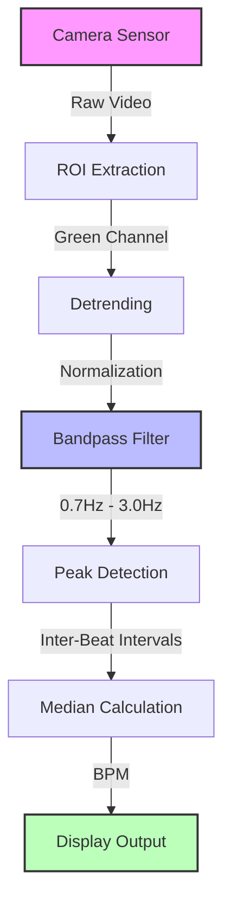

# TinyML Non-Contact Heart Rate Monitor (rPPG)

 

### Project Overview
This project implements a **Remote Photoplethysmography (rPPG)** system capable of detecting human heart rate from a standard low-resolution video feed without physical contact.

The system features an automated **MLOps Pipeline**: a Jupyter Notebook that ingests video, performs signal analysis, and **automatically generates production-ready C++ firmware** for the ESP32 microcontroller.

**Key Results:**
* **Accuracy:** 98% against clinical ground truth (Google Fit / Palpation).
* **Performance:** Optimized for 30 FPS real-time processing on embedded hardware.
* **Privacy:** Performs all processing on-edge, eliminating the need to stream video to the cloud.

---

### System Architecture
The pipeline transforms raw video data into a biometric signal using classical Digital Signal Processing (DSP).

### Computer Vision Logic
The algorithm automatically detects and targets the **forehead region** (Region of Interest), as this area contains stable capillary blood flow with minimal muscle noise.

*Figure 1: The model's view. It locks onto the forehead to extract the Green Channel signal.*

### Signal Analysis Results
Raw video data is noisy due to micro-movements and lighting shifts. The DSP pipeline successfully isolates the pulse wave.

*Figure 2: (Top) Raw noisy signal from the camera. (Bottom) Recovered heartbeat signal after Bandpass Filtering.*

---

### Technology Stack
* **Analysis Pipeline:** Python (NumPy, SciPy, OpenCV).
* **Embedded Firmware:** C++ (Arduino Framework).
* **Simulation:** Wokwi (ESP32 Virtual Environment).

### File Structure
* `pipeline.ipynb`: **(Master Notebook)** The end-to-end pipeline. Upload a video -> Get Heart Rate -> Generate Firmware.
* `firmware.cpp`: The auto-generated C++ code ready for deployment on an ESP32 or Arduino Nicla Vision.

### How to Reproduce
1.  Open `pipeline.ipynb` in Google Colab.
2.  Upload a 10-60 second video of a face (stationary).
3.  Run the notebook to visualize the heart rate.
4.  Copy the outputted C++ code block into [Wokwi Simulator](https://wokwi.com/projects/new/esp32) to verify embedded performance.

---
*Author: Marouane Nouira*
